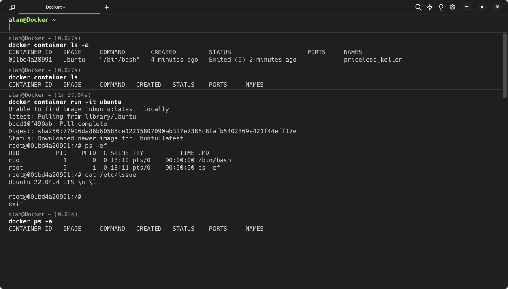

# Descomplicando o Docker com Jefersson Badtuxx - DAY 1

No primeiro dia do "Descomplicando o Docker", uma masterclass com Jefersson [Badtuxx](https://github.com/badtuxx) by LinuxTips, mergulhamos nos fundamentos do Docker de uma forma gostosinha de ai meu deus!

### O que aprendemos:

- Descobrimos o mundo dos containers e desmistificamos conceitos como Namespaces, Cgroups e o princípio de Copy-On-Write.
- Exploramos a crucial interação entre o Kernel Linux e o Docker.
- Aprendemos a criar e gerenciar containers, monitorar métricas, inspecionar containers e utilizar comandos como `docker exec`.
- Concluímos o dia com um exame prático, laboratório e um desafio para consolidar o aprendizado.

### Principais Tópicos:

- **Instalação do Docker com Curl:** `curl -fsSL https://get.docker.com | bash`
- **Primeiros Comandos:** `docker run`, `docker container ls`, e `ls -a`.
- **Executando um Container em Modo Daemon:** `docker container run -it` para interatividade com terminal, e `Ctrl + p & q` para sair do container sem terminar.
- **Gerenciamento de Estado do Container:** `docker container stop`, `pause`, `unpause` e `start`.
- **Remoção de Containers:** `docker container rm <nome_do_container>`.
- **Visualização de Métricas:** `docker container stats`, `docker container top <nome_do_container>`, e `docker container logs --follow`.
- **Limpeza de Recursos Parados:** Utilização do comando `prune`.
- **Manipulação de Imagens:** Utilização de `docker images` ou `docker image ls`, e análise de recursos com `docker inspect`.
- **Execução de Comandos dentro de Containers:** Utilização do `docker container exec`.
- **Exposição de Containers em Portas:** Utilização do parâmetro `-P`.
- **Baixando Imagens com Docker Pull:** Pré-baixe imagens para acelerar a criação de containers.
- **Criação de Containers sem Executar:** Utilize `docker container create`.

### Conheça mais:

Jefersson [Badtuxx](https://github.com/badtuxx) compartilha conhecimento valioso em seu canal do [YouTube](https://www.youtube.com/@LinuxTips) e na [Twitch](https://www.twitch.tv/linuxtips/videos). Todo o conteúdo do "Descomplicando o Docker" está disponível no YouTube, e também pode encontrar seu livro gratuitamente no [Github](https://github.com/badtuxx/DescomplicandoDocker). Se você está interessado em Docker, Linux, Kubernetes, DevOps, não deixe de conferir e seguir seus canais. Só #Vaiiii!
